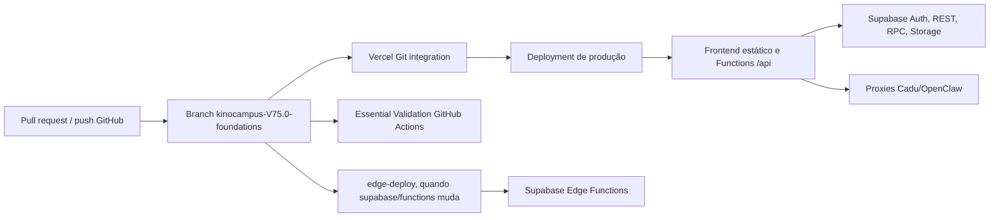

# Auditoria técnica KinoCampus - Fases 4 a 6

**Data:** 2026-07-09
**Branch de trabalho:** `codex/audit-phase4-6-2026-07-09`
**Base observada:** `kinocampus-V75.0-foundations` em `730a1c7b` antes das alterações desta rodada
**Complemento de:** `docs/audits/technical-audit-phase1-3-2026-07-09.md`

## Escopo, método e limites

Esta rodada aprofundou performance, segurança/robustez e operação GitHub-Vercel-Supabase. A análise combinou leitura do repositório, testes locais, GitHub CLI, Vercel CLI em modo somente leitura, navegador contra a produção e consultas remotas somente leitura ao Supabase.

**Fato observado** descreve uma configuração, código ou resposta efetivamente verificada. **Risco provável** tem evidência suficiente para priorização, mas precisa de contexto operacional adicional. **Hipótese/validação manual** não deve orientar alteração de produção sem confirmação.

Não foram executados deploy, alteração de segredo, migration, escrita no banco, `supabase db push`, alteração de configuração da Vercel/Supabase, nem comandos destrutivos.

## Resumo executivo

Não há P0 confirmado nesta rodada. Há, porém, riscos P1 operacionais e de segurança que devem ser tratados antes de ampliar mudanças estruturais:

1. A branch de produção não possui proteção detectável no GitHub e o push para a base aciona deploy Vercel antes da validação de CI terminar. O incidente atual foi observável: a Vercel publicou `730a1c7b`, enquanto a workflow Essential Validation falhava por dois testes obsoletos.
2. O Supabase informa que a proteção contra senhas vazadas está desabilitada. A correção é uma configuração manual de Auth, de baixo risco e alto valor.
3. O histórico remoto de migrations e a estratégia local baseline v76 são deliberadamente diferentes. Não é seguro assumir que `supabase db push` reconcilia os ambientes sem um plano de migração testado em branch Supabase.
4. A produção concedia `anon` em wrappers públicos de RPC do chat que a migration de hardening pretendia revogar. Os corpos privados verificam `auth.uid()`, portanto não foi demonstrado acesso indevido, mas os grants devem ser reconciliados e testados em ambiente isolado.
5. O navegador observou requisições iniciais duplicadas no feed. Esta rodada corrige, com teste, a deduplicação de contagens de categorias e a corrida de carregamento de anúncios.

## Fase 4 - Performance e responsividade

### Inventário de carga inicial

| Página medida localmente | Scripts | JavaScript local, sem compressão | Leitura |
|---|---:|---:|---|
| `index.html` | 96 (94 locais, 2 externos) | ~1.538 KiB | A página inicial concentra muitos recursos globais |
| `eventos.html` | 96 | ~1.531 KiB | Cadeia próxima à inicial |
| `mensagens.html` | 77 | ~1.288 KiB | Ainda substancial para uma página focada em chat |
| `_product.html` | 99 | ~1.602 KiB | Maior cadeia medida |
| `admin/cadu.html` | 34 | ~619 KiB | Menor carga inicial, mas controller grande |

**Fato observado:** todos os scripts dessas cadeias usam `defer`. Isso evita bloqueio direto do parser HTML, mas não elimina custo de download, parse e execução depois do documento.

**Fato observado positivo:** bibliotecas pesadas de exportação administrativa são carregadas sob demanda por `assets/js/shared/admin-export.shared.js`, em vez de fazerem parte da cadeia inicial: `exceljs.min.js` (~925,5 KiB), `xlsx.full.min.js` (~861,1 KiB) e `jspdf.umd.min.js` (~357,5 KiB).

### Chamadas duplicadas confirmadas e correção aplicada

| Problema | Evidência de produção | Correção pequena | Arquivos | Cobertura |
|---|---|---|---|---|
| Contagens de categorias repetidas | Três POSTs idênticos para `rpc/kc_home_category_post_counts` na inicialização da home | Compartilhamento de Promise em voo até preencher o cache | `assets/js/features/kc-home-categories.js` | `tests/integration/kc-home-categories-network.test.js` |
| Anúncios iniciais repetidos | Duas chamadas idênticas de `kc_get_feed_ad_config` e `kc_get_feed_ads` | Guarda única entre `kc:authchange` e fallback temporizado | `assets/js/features/kc-ads.js` | `tests/integration/kc-ads.test.js` |

Essas mudanças não alteram parâmetros das RPCs, respostas, cache persistente ou regras de visibilidade. Elas apenas fazem consumidores concorrentes aguardarem a mesma operação inicial. Caso uma tentativa falhe, a guarda em voo é liberada para permitir tentativa posterior.

### Gargalos e plano de otimização

| Prioridade | Problema | Evidência | Métrica afetada | Dificuldade / risco | Ganho esperado | Recomendação |
|---|---|---|---|---|---|---|
| P1 | Cadeias grandes de JS em páginas públicas | 77-99 scripts e 1,3-1,6 MiB locais sem compressão | LCP, TBT, INP em rede/dispositivo fraco | Média / média | Redução mensurável de parse e execução | Criar orçamento por rota; separar features específicas de feed, criação e produto antes de introduzir bundler |
| P1 | Falta de gate entre CI e deploy de produção | Vercel publica por push na base; CI posterior falhou | Confiabilidade e rollback | Baixa / média | Evita produção com regressão detectável | Exigir checks e PR antes de push na base |
| P2 | Calendário solicita até 500 eventos | Consulta REST compartilhada em home/eventos usa `limit=500` | Latência, transferência e memória | Média / média | Menor custo conforme base cresce | Desenhar paginação por intervalo de calendário, preservando navegação mensal antes de mudar |
| P2 | Feed cursor teve resposta lenta em uma amostra | Cabeçalho observou ~1.483 ms para `kc_get_feed_cursor` | TTFB/listagem | Baixa / baixa | Ainda indeterminado | Medir percentis no Supabase/Vercel por ao menos 7-30 dias; usar `EXPLAIN (ANALYZE, BUFFERS)` em réplica/branch |
| P2 | `kc_unit_meta.updated_by` sem índice cobrindo FK | Advisor remoto Supabase | Escritas/deleções no usuário referenciado | Baixa / baixa | Evita scans em crescimento | Planejar `CREATE INDEX CONCURRENTLY` em migration após validar volume e histórico |
| P2 | Expressões RLS recalculam `auth.uid()` | Três policies de `kc_unit_meta` no advisor | Planejamento de consultas | Baixa / baixa | Pequeno a moderado | Trocar por `(select auth.uid())` em migration testada; validar política e plano |
| P2 | Índices marcados como não usados | Advisor remoto mostrou vários `INFO` | Custo de escrita/armazenamento | Média / alta se removido incorretamente | Potencial moderado | Não remover automaticamente; coletar uso real por pelo menos 30 dias e cruzar com fluxos sazonais |
| P3 | Controllers extensos | `admin-cadu.controller.js` ~128 KiB; `chat-inbox.controller.js` ~90 KiB | Manutenção e regressão | Média / média | Evolução mais previsível | Extrair por aba/comando somente junto de testes de comportamento |

### Responsividade e Core Web Vitals

**Fato observado:** a presente rodada mediu estrutura e rede, mas não gerou um conjunto comparável de métricas Lighthouse mobile/desktop em ambiente limpo. A execução completa de Playwright local foi interrompida pelo runner depois de 26/85 casos, sem falha de aplicação identificada; não deve ser tratada como aprovação completa de E2E.

**Validação manual recomendada:** executar Lighthouse CI contra preview Vercel limpo, com orçamento inicial por rota (`index`, `eventos`, `mensagens`, produto e Cadu); preservar os valores como baseline em artefato de CI.

## Fase 5 - Segurança e robustez

### Controles confirmados

| Controle | Estado observado | Leitura |
|---|---|---|
| RLS de tabelas públicas | 43 relações públicas consultadas com `relrowsecurity = true` e ao menos uma policy | Cobertura ampla; não substitui revisão semântica policy a policy |
| Segredos de Cadu | `CADU_API_TOKEN` permanece server-side nos proxies; `scripts/inject-env.js` só injeta URL/chave pública/driver Supabase | Não há evidência local de service role sendo injetada no frontend |
| Cadu administrativo | Rotas exigem `requireCaduAdmin`, que valida usuário Supabase e perfil/RPC administrativo | CORS amplo não equivale a rota administrativa aberta |
| Edge `kc-invite-user` | `verify_jwt: false`, mas a função valida Bearer e administração antes de usar service role | Autorização customizada, não endpoint aberto por configuração isolada |
| Edge `kc-dispatch-notification-outbox` | `verify_jwt: false`, mas compara secret de dispatch em tempo constante | Controle customizado; secret e rotação ainda devem ser operacionais |
| Dependências runtime | `npm audit --omit=dev --json` não encontrou vulnerabilidade de produção | Separar esse fato do audit completo de ferramentas de desenvolvimento |

### Riscos e recomendações

| Prioridade | Classificação | Achado | Evidência | Impacto | Recomendação segura |
|---|---|---|---|---|---|
| P1 | Confirmado | Proteção contra senhas vazadas desabilitada | Supabase Security Advisor: `auth_leaked_password_protection` | Facilita uso de credenciais comprometidas | Habilitar no Dashboard Supabase Auth; registrar data e validar cadastro/reset |
| P1 | Confirmado no grant, sem exploração demonstrada | RPCs públicas de chat ainda têm execução `anon` | Grants remotos para `kc_chat_list_messages`, `kc_chat_set_message_reply`, `kc_chat_toggle_reaction` | Defesa em profundidade reduzida; futura mudança interna pode transformar em bypass | Em branch Supabase, revogar `PUBLIC`/`anon`, conceder somente `authenticated`, testar anônimo, dono, participante e não participante |
| P1 | Risco provável | JWT administrativo aceito por query `kc_admin_token` | `server/cadu-auth.mjs`, necessário para EventSource/download | Token pode surgir em histórico, logs ou referer dependendo do cliente | Projetar ticket de uso único/curta duração ou transporte compatível por cookie; manter remoção antes do proxy |
| P2 | Risco provável | CORS `*` nas rotas Cadu | Cabeçalhos dos handlers `api/cadu/*` | Amplia superfície de origem, apesar da autenticação | Restringir aos domínios oficiais após validar console, EventSource e preview Vercel |
| P2 | Confirmado | Dependências de desenvolvimento com advisories | `npm audit` completo: 15 achados, incluindo cadeia Babel/Lighthouse/Jest | CI/local vulneráveis ou desatualizados; runtime limpo | Atualizar em PR próprio, checar breaking changes e manter lockfile auditável; não usar `npm audit fix` automático |
| P2 | Hipótese | Schema privado remotamente exposto via PostgREST | Config local limita schemas, mas `current_setting` remoto não confirmou a configuração | Poderia ampliar API se configurado incorretamente | Validar `pgrst.db_schemas` no Dashboard/connection administrativa e testar endpoint sem credencial |
| P3 | Hipótese ambiental | Script Vercel Insights retornou MIME inesperado/499 | Navegador com interferência de antivírus local | Telemetria pode faltar para alguns clientes | Repetir em navegador limpo/rede distinta antes de alterar integração |

### Funções e RLS: conclusão de escopo

Há muitas funções `SECURITY DEFINER` no baseline; contagem isolada não prova vulnerabilidade. A verificação remota de `kc_private.kc_chat_list_messages` mostrou guarda explícita de `auth.uid()` antes da consulta. As wrappers públicas são `SECURITY INVOKER` e as privadas verificam identidade antes de mutar. A prioridade é corrigir grants e instituir testes de autorização, não reescrever indiscriminadamente funções existentes.

## Fase 6 - Operação GitHub, Vercel e Supabase

### Fluxo operacional observado

**Fato observado:** a Vercel listou deployment de produção pronto para `730a1c7b` em 2026-07-09. As duas execuções recentes de Essential Validation para commits da base falharam por expectativas antigas de limite de imagens (`5`) após o produto ter passado a usar `12`. Portanto, neste estado, produção poderia receber código antes do sinal de CI verde.

**Fato observado:** `edge-deploy.yml` roda por push na base quando `supabase/functions/**` muda. Usa `supabase/setup-cli@v1` com `version: latest` e contém `supabase link ... || true`. Ele não depende de conclusão bem-sucedida de Essential Validation.

### Mapa de ambiente e deploy

| Camada | Estado observado no código | Validação pendente |
|---|---|---|
| Frontend | `scripts/inject-env.js` materializa somente URL Supabase, chave pública e driver em `assets/js/boot/kc-env.js` | Conferir na Vercel que os valores existem e são consistentes entre Preview/Production sem exportar secrets |
| Vercel Functions | Leem variáveis server-side de Cadu e outras APIs | Inventariar nomes e presença no dashboard, sem mostrar valores |
| Supabase Edge Functions | Oito funções versionadas e workflow de deploy separado | Testar cada função em branch Supabase e fixar versão da CLI |
| Supabase schema | Baseline v76 local + incrementais; remoto conserva cadeia histórica | Criar procedimento explícito de reconciliação antes de qualquer `db push` |
| GitHub Actions | Validação, Lighthouse, email e deploy Edge separados | Exigir checks, branch protection e Dependabot |

### Migrations e risco de rollback

**Fato observado:** o repositório preserva migrations v75 em `supabase/migrations/_archive-v75` e apresenta baseline `00000000000001_baseline_v76.sql` mais incrementais ativos. O remoto ainda registra uma cadeia histórica, incluindo versão de hardening de chat com timestamp distinto do arquivo ativo equivalente. Essa estratégia pode ser válida para bootstrap local, mas o histórico não permite presumir que uma sincronização padrão seja segura.

**Regra operacional proposta:** até haver reconciliação documentada e testada, proibir `supabase db push` contra produção a partir deste clone. Qualquer alteração de schema deve primeiro passar por branch Supabase ou banco local resetável, com teste de upgrade e plano de rollback.

### Lacunas de governança confirmadas

| Prioridade | Achado | Evidência | Efeito | Próxima ação |
|---|---|---|---|---|
| P1 | Branch base sem proteção detectável | API GitHub de branch protection retornou 404 | Push direto e deploy antes de revisão/checks | Configurar required PR reviews, required status checks e restringir push direto |
| P1 | Deploy de Edge pós-merge sem gate de validação | Workflow independente por push | Function pode publicar apesar de falha na suite principal | Mudar para workflow dependente ou environment approval; testar em PR de infraestrutura |
| P1 | Histórico de migrations divergente | Baseline local versus versões remotas históricas | Alto risco de erro operacional se `db push` for usado | Plano de reconciliação e CI que bloqueie push não revisado |
| P2 | CLI Supabase não fixada e falha de link mascarada | `version: latest`, `|| true` em workflow | Mudança de ferramenta ou vínculo quebrado passa despercebida | Fixar versão conhecida e falhar de forma explícita após diagnosticar projeto |
| P2 | Alertas Dependabot desabilitados | Endpoint GitHub respondeu 403 por recurso desabilitado | Menor visibilidade de CVEs | Habilitar Dependabot alerts e atualizações semanais agrupadas |
| P2 | Configuração real de variáveis não auditada | Worktree não estava ligado à Vercel; secrets não foram lidos | Divergência local/preview/prod pode existir | Checklist de nomes/presença por ambiente no dashboard, sem expor conteúdo |

## Alterações pequenas desta rodada

1. Atualiza os dois contratos de teste de limite de upload de imagem de `5` para `12`, refletindo o comportamento já introduzido no código funcional.
2. Deduplica a consulta de contagens de categorias concorrentes da home.
3. Impede duas cargas iniciais simultâneas de anúncios quando o fallback e `kc:authchange` ocorrem próximos.
4. Adiciona teste comportamental para a deduplicação de categorias e contrato de regressão para a guarda de anúncios.

**Risco de regressão:** baixo. As mudanças preservam formato de dados e APIs; reduzem apenas trabalho repetido. O cache e a possibilidade de nova tentativa após erro permanecem intactos.

## Validação executada

| Comando | Resultado |
|---|---|
| `npx jest --runInBand tests/integration/kc-home-categories-network.test.js tests/integration/kc-ads.test.js tests/integration/kc-create-post-media.test.js tests/integration/supabase-media-adapter.test.js` | 4 suítes, 106 testes aprovados |
| `npm run check:all` | 203 suítes, 3.902 testes e 3 snapshots aprovados; validadores de estrutura, cadeias, rotas, higiene e registro de busca aprovados |
| `git diff --check` | Aprovado; apenas avisos locais de normalização LF/CRLF |
| `npx playwright test --workers=1 --reporter=line` | Não concluído: runner local ficou sem progresso após 26/85 testes e foi encerrado sem alteração de código; não representa aprovação E2E completa |

## Matriz mínima de testes antes de mudanças de maior risco

| Fluxo | Casos mínimos |
|---|---|
| Auth | Anônimo, sessão expirada, usuário autenticado, admin, reset de senha e senha vazada |
| Chat/RPC | Anônimo não executa; participante lê/muta próprio contexto; não participante falha; admin só onde previsto; reply/reaction preservam RLS |
| Feed | Home sem duplicar RPCs; cache expira; fallback funciona; paginação e calendário não perdem itens |
| Cadu | Sem token, token inválido, não-admin e admin; SSE/download sem expor JWT em URL persistente |
| Edge Functions | JWT obrigatório ou secret válido conforme função; CORS; falha segura; logs sem dados sensíveis |
| Migrations | Bootstrap novo; upgrade a partir do estado histórico representativo; rollback lógico; policies e grants verificados |
| UI crítica | Desktop e mobile para feed, eventos, chat, criação/edição e páginas admin; screenshots de regressão |
| CI/deploy | Build Vercel, Essential Validation, Lighthouse e Edge deploy somente após checks aprovados |

## Roadmap priorizado

### P0 - Corrigir imediatamente

Nenhum P0 confirmado sem evidência adicional de indisponibilidade, vazamento de dados ou bypass de autorização.

### P1 - Curto prazo

1. **Restaurar gate de entrega:** abrir PR para as correções de testes/deduplicação; então exigir PR + Essential Validation verde antes de merge na base. Validar que o deploy de produção só ocorra após a política definida.
2. **Habilitar proteção de senhas vazadas:** mudar a opção no Supabase Auth e registrar no runbook; testar cadastro e reset.
3. **Reconciliar migrations:** produzir mapa versão remota/local, testar em branch Supabase e definir um único procedimento de alteração. Não usar `db push` de modo ad hoc.
4. **Corrigir grants de chat:** após a reconciliação, aplicar migration reversível em ambiente isolado e executar a matriz anônimo/autenticado.
5. **Governar Edge deploy:** fazer o workflow depender da validação, fixar a versão da CLI e remover o mascaramento de falha de link após diagnóstico.

### P2 - Próximo ciclo

1. Criar orçamento de JavaScript por rota e adiar módulos não essenciais, sem reescrever a aplicação.
2. Redesenhar a busca de calendário por janela temporal/paginação.
3. Corrigir índice de FK e initplans RLS de `kc_unit_meta` por migrations testadas.
4. Restringir CORS Cadu e substituir JWT em query por mecanismo efêmero apropriado.
5. Habilitar Dependabot e atualizar a cadeia de desenvolvimento em PR dedicada.
6. Medir p50/p95 de RPCs e Core Web Vitals em preview/produção antes de otimizações maiores.

### P3 - Acabamento e documentação

1. Dividir controllers grandes em módulos por responsabilidade quando houver testes de regressão.
2. Registrar inventário de variáveis por nome, escopo e ambiente, sem valores.
3. Consolidar o runbook de deploy/rollback e atualizar referências históricas nos documentos Cadu.
4. Revalidar integração Vercel Insights em browser sem interferência local.

## Próximos passos seguros

1. Revisar esta mudança em PR e executar a CI remota, inclusive a suite E2E que não concluiu localmente.
2. Tratar configurações externas P1 no dashboard com checklist e evidência registrada, sem colocar valores sensíveis no repositório.
3. Abrir uma tarefa exclusiva para migrations/grants de chat, com branch Supabase e plano de testes, antes de produzir SQL de produção.
4. Só então avançar às fases 7-9: matriz executável de testes, plano de ação consolidado e atualização dos runbooks operacionais.
