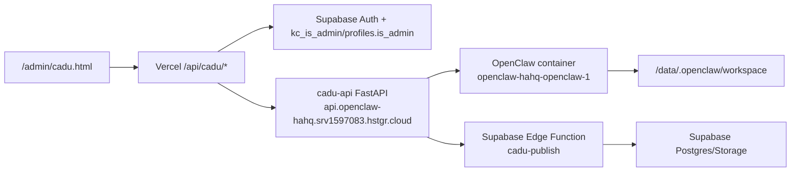

# Cadu/OpenClaw — mapa operacional de continuidade

**Data:** 2026-06-27  
**Escopo:** registrar conexões, rotas, variáveis e pontos de controle necessários para continuar o desenvolvimento do painel `/admin/cadu.html`, da cadu-api na VPS Hostinger, do OpenClaw e da publicação via Supabase sem depender de contexto de chat.

Este documento não registra tokens, senhas, service role keys ou valores reais de `.env`.

## Visão de arquitetura



## Pontos de conexão conhecidos

| Área | Conexão | Uso | Observações |
|---|---|---|---|
| Admin UI | `/admin/cadu.html` | Operação manual de sites, feed, pipeline e OpenClaw | Browser deve falar preferencialmente com `/api/cadu/*` same-origin. |
| Vercel proxy | `/api/cadu/sites`, `/feed`, `/publish`, `/pipeline/*`, `/openclaw/*` | Isola o browser da VPS e injeta `CADU_API_TOKEN` server-side | Endpoints, exceto health, exigem JWT Supabase de admin. |
| VPS pública | `https://api.openclaw-hahq.srv1597083.hstgr.cloud` | cadu-api FastAPI atrás de Traefik | Usar direto só para operação/debug autorizado. |
| VPS host | `srv1597083.hstgr.cloud` / `187.77.37.25` | Hostinger VPS com Docker | O README/env local indica acesso SSH com chave `~/.ssh/openclaw_vps`. |
| cadu-api container | `openclaw-hahq-cadu-api` | API operacional | Porta interna padrão documentada: `49104`. |
| OpenClaw container | `openclaw-hahq-openclaw-1` | Execução dos scripts Cadu | Usa workspace e memória persistentes em `/data/.openclaw`. |
| Browser CDP | porta `18800` dentro do container OpenClaw | Scanner Instagram/Playwright/headless | Validar antes de rodar estágios `ig`, `curator`, `duplicates` se houver falha de browser. |
| Workspace OpenClaw | `/data/.openclaw/workspace` | Scripts `pipeline-kino.js`, `pipeline-emails.js`, scanners e publicadores | Fonte operacional da pipeline remota. |
| Memória OpenClaw | `/data/.openclaw/memory/main.sqlite` | Chunks/feed usados pelo painel | Lida pela cadu-api em `/api/feed`. |
| Supabase project | `wacyrkwhkvzwkqpolrbg` | Auth, Postgres, Storage e Edge Functions | Service role nunca deve ir para frontend. |
| Edge Function | `supabase/functions/cadu-publish` | Publicar/editar/listar posts confiáveis do Cadu | Valida JWT da conta Cadu e allowlist `kc_trusted_publishers`. |

## Rotas operacionais

### Vercel `/api/cadu/*`

| Rota | Método típico | Encaminha para VPS | Autorização esperada |
|---|---:|---|---|
| `/api/cadu/health` | GET | `/health` | Liveness público/limitado; não deve executar ação. |
| `/api/cadu/sites` | GET/PATCH | `/api/sites` e `/api/sites/{unit}/meta` | Admin Supabase. |
| `/api/cadu/feed` | GET | `/api/feed` e subrotas por `path` | Admin Supabase. |
| `/api/cadu/publish` | POST | `/api/publish` | Admin Supabase. |
| `/api/cadu/pipeline` | GET/POST | `/api/pipeline` | Admin Supabase. |
| `/api/cadu/pipeline/{...}` | GET/POST/SSE | `/api/pipeline/{...}` | Admin Supabase; EventSource usa `kc_admin_token` same-origin. |
| `/api/cadu/openclaw/{...}` | GET/POST | `/api/openclaw/{...}` | Admin Supabase. |

### cadu-api VPS

Rotas encontradas em código/documentação MiniMax/OpenClaw:

- `/health`
- `/api/sites`
- `/api/sites/{unit_id}/meta`
- `/api/feed`
- `/api/feed/{chunk_id}`
- `/api/feed/{chunk_id}/ask`
- `/api/publish`
- `/api/pipeline`
- `/api/pipeline/run`
- `/api/pipeline/runs`
- `/api/pipeline/{run_id}`
- `/api/pipeline/{run_id}/stop`
- `/api/pipeline/{run_id}/stream`
- `/api/pipeline/{run_id}/artifacts`
- `/api/pipeline/{run_id}/log`
- `/api/pipeline/{run_id}/export`
- `/api/openclaw/status`
- `/api/openclaw/sessions`
- `/api/openclaw/messages`
- `/api/openclaw/logs`
- `/api/openclaw/heartbeat`
- `/api/openclaw/context`
- `/api/openclaw/agent-send`
- `/api/openclaw/agent-event`
- `/api/admin/redeploy`

## Variáveis de ambiente por camada

### Vercel / serverless do KinoCampus

- `CADU_API_URL`
- `CADU_API_TOKEN`
- `KC_SUPABASE_URL` ou `SUPABASE_URL` ou `VITE_SUPABASE_URL`
- `KC_SUPABASE_ANON_KEY` ou `SUPABASE_ANON_KEY` ou `SUPABASE_PUBLISHABLE_KEY` ou `VITE_SUPABASE_ANON_KEY`

Uso: validar JWT/admin em `server/cadu-auth.mjs` e encaminhar chamadas à VPS com token Cadu apenas no servidor.

### cadu-api na VPS

- `CADU_API_TOKEN`
- `OPENCLAW_WORKSPACE`
- `OPENCLAW_MEMORY_DB`
- `KINOCAMPUS_SUPABASE_URL`
- `KINOCAMPUS_SUPABASE_KEY`
- `KINOCAMPUS_PUBLISH_URL`
- `CADU_KINO_EMAIL`
- `CADU_KINO_PASSWORD`
- `TELEGRAM_BOT_TOKEN`
- `TELEGRAM_CHAT_ID`
- `OPENCLAW_CONTAINER`
- `CADU_API_CONTAINER`
- `PORT`

Uso: autenticar chamadas administrativas, ler memória/workspace OpenClaw, logar a conta Cadu no Supabase Auth e publicar via Edge Function.

### Supabase Edge Function `cadu-publish`

- `SUPABASE_URL`
- `SUPABASE_ANON_KEY`
- `SUPABASE_SERVICE_ROLE_KEY`
- `KC_APP_BASE_URL`

Uso: validar o JWT do usuário Cadu, consultar `kc_trusted_publishers`, criar/editar posts, persistir mídia no Storage `kino-media` e registrar auditoria.

### Publisher Node legado/paralelo

O serviço `services/cadu-ufg-publisher` ainda documenta uma trilha Node paralela/legada. Variáveis principais:

- `CADU_SUPABASE_URL`
- `CADU_SUPABASE_ANON_KEY`
- `CADU_KINO_EMAIL`
- `CADU_KINO_PASSWORD`
- `TELEGRAM_BOT_TOKEN`
- `TELEGRAM_CHAT_ID`
- `RESEND_API_KEY`
- `DEEPSEEK_API_KEY`

Antes de evoluir esse caminho, decidir se ele permanece como fallback ou se será consolidado atrás da cadu-api + Edge Function.

## Fontes locais relevantes

| Fonte | Para quê usar |
|---|---|
| `admin/cadu.html` | Layout e shell do painel Cadu. |
| `assets/js/controllers/admin/admin-cadu.controller.js` | Cliente do painel, tabs, SSE, pipeline, OpenClaw e chamadas ao proxy. |
| `api/cadu/*.js` | Proxies Vercel para sites/feed/publish/pipeline/openclaw. |
| `server/cadu-auth.mjs` | Validação de JWT Supabase + autorização admin. |
| `pipeline/PIPELINE_STAGES.json` | Catálogo local de estágios exibidos no admin. |
| `docs/PIPELINE.md` | Runbook técnico da pipeline. |
| `supabase/functions/cadu-publish/*` | Contrato canônico de publicação confiável do Cadu. |
| `services/cadu-ufg-publisher` | Publisher Node anterior/paralelo. |
| `C:\Users\yan1n\.minimax-agent\projects\openclaw-cadu` | Código/documentação MiniMax/OpenClaw v0.4.x. |
| `C:\Users\yan1n\.minimax-agent\projects\cadu-api-server.py` | FastAPI consolidada fora do repo principal. |
| `C:\Users\yan1n\ZCodeProject\kino-campus` | Sandbox Z.ai Code com artefatos comparáveis. |
| `C:\Users\yan1n\ZCodeProject\kc-baseline-sandbox` | Baseline/sandbox ZCode para auditorias e regressão. |

## Pendências encontradas nesta consolidação

| Prioridade | Pendência | Ação recomendada |
|---|---|---|
| P0 | `CADU_API_TOKEN` já esteve em JS público antes do hardening. | Rotacionar na VPS e na Vercel; invalidar deploys antigos que ainda possam servir bundle vulnerável. |
| P1 | Confirmar envs Supabase no projeto Vercel. | Sem URL/anon/publishable key, `server/cadu-auth.mjs` retorna erro de configuração e bloqueia `/api/cadu/*`. |
| P1 | Confirmar deploy do Edge Function `cadu-publish` após ajuste de URLs canônicas. | `compra-venda` deve gerar `compra-venda-feed.html`; `caronas` deve gerar `caronas-feed.html`. |
| P1 | Sincronizar catálogo local e remoto de stages. | `pipeline/PIPELINE_STAGES.json` e o `PIPELINE_STAGES` do Python devem permanecer equivalentes. |
| P1 | Validar SSE de pipeline em produção. | Fluxo atual usa proxy Vercel com autenticação admin; runs acima de `maxDuration` podem exigir fallback operacional de log tail/reconexão. |
| P2 | Decidir destino do publisher Node legado. | Manter como fallback documentado ou remover/arquivar para reduzir duplicidade. |
| P2 | Criar testes unitários para `server/cadu-auth.mjs` e proxies Cadu. | Hoje há check sintático e testes gerais; falta contrato focado de auth/proxy. |
| P2 | Revisar CSP depois de estabilizar proxy. | Se o browser não precisar mais falar direto com `api.openclaw-hahq.srv1597083.hstgr.cloud`, remover essa origem de `connect-src`. |
| P2 | Definir política de `/api/cadu/health`. | Hoje deve permanecer liveness sem ação; se expuser detalhes sensíveis, exigir admin ou reduzir payload. |

## Runbook rápido de continuidade

1. Antes de qualquer mudança operacional, conferir se há alterações locais em andamento:
   ```powershell
   git status --short --branch
   ```
2. Para validar syntax dos arquivos Cadu/Kino:
   ```powershell
   node --check server/cadu-auth.mjs
   node --check api/cadu/sites.js
   node --check api/cadu/feed.js
   node --check api/cadu/publish.js
   node --check api/cadu/pipeline.js
   node --check api/cadu/pipeline-router.js
   node --check api/cadu/openclaw-router.js
   node --check assets/js/controllers/admin/admin-cadu.controller.js
   deno check --node-modules-dir=auto supabase/functions/cadu-publish/index.ts
   ```
3. Para validar regressão geral:
   ```powershell
   npm run check:all
   ```
4. Após deploy, smoke mínimo:
   - admin Supabase carrega `/admin/cadu.html`;
   - usuário não-admin recebe 403 em `/api/cadu/sites`;
   - `/api/cadu/sites` retorna inventário;
   - `/api/cadu/feed` retorna chunks;
   - `/api/cadu/pipeline` retorna catálogo/histórico;
   - iniciar um stage curto e acompanhar SSE;
   - baixar log/export de uma run;
   - enviar uma pergunta ao OpenClaw.
5. Se o painel falhar:
   - verificar envs Vercel primeiro;
   - verificar `profiles.is_admin`/RPC `kc_is_admin`;
   - verificar `CADU_API_TOKEN` em Vercel e VPS;
   - verificar container `openclaw-hahq-cadu-api`;
   - verificar CDP `18800` para estágios que usam browser;
   - só depois considerar rollback de código.

## Regras de segurança para futuras alterações

- Nunca recolocar `CADU_API_TOKEN`, service role key ou senha Cadu no JavaScript público.
- Não usar allowlist de e-mail no client como autorização.
- `kc_admin_token` só é aceitável para limitações do browser (`EventSource`/download) e apenas contra rota same-origin protegida.
- Todo controle operacional da VPS deve passar por admin Supabase no proxy ou por acesso direto autenticado fora do browser público.
- Reports devem registrar comportamento, rotas e validação, mas nunca valores de segredo.
