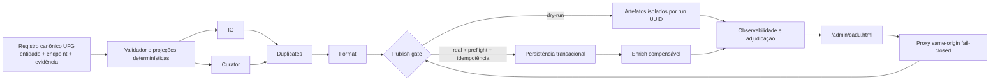

# Cadu: fechamento técnico da fase e plano de continuidade

Data de corte: 2026-07-13, America/Sao_Paulo

> **Nota de continuidade (2026-07-14):** este documento preserva uma fotografia histórica. A linha
> “Espelho versionado no Kino” da seção 2 não deve ser usada como configuração corrente. A fonte de
> verdade operacional passou a ser `services/cadu-ufg-publisher/config/cadu-source-registry/upstream-manifest.json`,
> sob o contrato descrito em `docs/CADU-SOURCE-REGISTRY-MIRROR-2026-07-13.md`. O novo importador só
> aceita um commit já alcançável em `origin/main`, catálogo upstream `shadow` consumido exclusivamente
> por `cadu-api`, zero fontes/perfis habilitados e projeção local `candidate` estritamente somente leitura.

## 1. Decisão executiva

Esta fase pode ser encerrada como **implementação local pronta para revisão**, condicionada à
validação integral e aos checks dos pull requests. Ela **não** pode ser encerrada como rollout de
produção.

O estado operacional continua **NO-GO para migrations remotas, ativação de fontes, publicação
real e merge automático dos dois repositórios**. Os motivos não são cosméticos:

1. o ledger remoto de migrations Supabase diverge da cadeia local;
2. o contrato de controle da pipeline depende de mudanças coordenadas entre KinoCampus e
   OpenClaw;
3. o registro canônico ainda está em shadow, com todas as fontes desativadas e conflitos de
   ownership/evidência por resolver;
4. dry-run seguro não equivale a publish seguro, transacional e idempotente;
5. merge em `main` no OpenClaw pode ser consumido automaticamente pelo git-sync da VPS.

Portanto, “concluído” neste documento significa: causa reproduzida, correção implementada, prova
local automatizada, risco residual documentado e rollback definido. Não significa que produção
foi alterada.

## 2. Fotografia confirmada

| Superfície | Fato observado | Consequência |
|---|---|---|
| KinoCampus | base `kinocampus-V75.0-foundations` em `81af0d5f`; CI da base verde | ponto de retorno conhecido |
| OpenClaw | PR `#19` em draft; head anterior desta rodada `d44d95d` | não mesclar antes dos gates cruzados |
| Registro UFG | `2026-07-13.6`: 170 entidades, 197 fontes web, 86 perfis Instagram, zero habilitados | contrato ainda candidato/shadow |
| Espelho versionado no Kino | `2026-07-13.1`: 166/194/83, upstream `2d579048...` | coerente internamente, mas deliberadamente não sincronizado antes do merge OpenClaw |
| `kc_unit_meta` remoto | 59 linhas compatíveis com o novo domínio de dados | dado não bloqueia Phase A |
| Schema remoto | PG 17.6, seis colunas, policies/ACLs legadas e RPCs CAS ausentes | Phase A ainda não aplicada |
| Ledger remoto | versões remotas ausentes da árvore local; cadeia local adicional | `db push` e `migration repair` são NO-GO |
| Admin Cadu | catálogo fail-closed; ações dependem de readiness e contrato fresco | falha de controle não degrada para ação legada |
| Pipeline | controle versionado e dry-run isolado implementados localmente | requer prova e rollout coordenado |

As contagens são fotografia, não meta de qualidade. Aumentar cobertura sem resolver associação,
evidência e precisão amplia falsos positivos.

O subconjunto estritamente elegível continua vazio. Na fotografia auditada, 131 fontes web têm
identidade confirmada, apenas 13 têm transporte verificado e somente três têm todos os endpoints
confirmados; essas três ainda possuem tier ausente e conflito de URL. No Instagram, 85 perfis
estão pendentes e um aposentado; nenhum está confirmado para execução. Permanecer com zero
habilitados é, portanto, comportamento correto e não falta de rollout.

## 3. Resultado desta fase

### 3.1 Phase A de metadados Cadu

O lote local:

- reconcilia constraint, índice, trigger, RLS, policies e ACLs de `kc_unit_meta`;
- restringe a trigger ao `service_role` e remove `MAINTAIN` de clientes de API;
- expõe RPCs CAS com contrato exato e probe `cadu-unit-meta-cas-v1`;
- rejeita overloads inesperados das RPCs;
- normaliza CRLF/LF antes de comparar corpos de funções;
- prova upgrade sobre fixture sanitizada equivalente ao fingerprint remoto;
- preserva a tupla legada completa, inclusive `tier`, `note`, `source`, `revision` e
  `updated_at`;
- prova em PostgREST real: service probe pronto, anon/auth sem escrita, named arguments,
  concorrência CAS `200/412`, shadow legado `409` e revisão final coerente;
- é repetível e limpa sua própria fixture.

Exceção importante: as migrations `20260713183000` e `20260713184500` já existem na história Git,
mas foram confirmadas como ausentes no ambiente remoto observado. Corrigi-las in-place é adequado
para a primeira aplicação nesse ambiente específico. Isso **não** corrige um ambiente desconhecido
que já tenha registrado essas versões. Antes do rollout, cada ambiente precisa ser inventariado:

- ambiente descartável: reset e reaplicação da cadeia;
- ambiente persistente sem as versões: aplicação controlada após reconciliar o ledger;
- ambiente persistente com as versões: nova migration forward-only corretiva, nunca confiar que a
  versão antiga será reaplicada.

### 3.2 Boundary de controle Cadu

O proxy same-origin agora centraliza:

- allowlist exata de método, rota, IDs e query;
- rejeição de traversal simples, codificado e multicamada;
- reconstrução da URL upstream a partir de segmentos validados;
- token apenas no servidor, sem repasse de credenciais do navegador;
- redirect bloqueado, timeout, limites de request, response e SSE;
- encerramento de stream no disconnect;
- erros sanitizados sem refletir stack, HTML, stderr ou token.

Novos endpoints devem ser incluídos deliberadamente. A ausência de fallback permissivo é parte do
contrato de segurança.

### 3.3 `/admin/cadu.html`

O controle da Pipeline Completa agora exige um snapshot fresco e válido:

- `contract_version = cadu-pipeline-control-v1`;
- `generated_at` dentro do TTL;
- capabilities exatas e rotas explícitas;
- estágios únicos;
- preflight do mesmo estágio, fresco, com comando validado, script coerente e conjuntos de
  blockers/warnings exatamente derivados dos checks;
- `preflight.can_run === true` no clique e novamente depois da confirmação;
- modo dry-run/real explícito, sem fallback para `/run`;
- respostas atrasadas de uma geração anterior são ignoradas;
- erro ou expiração invalida o controle e remove/desabilita ações.

Campos remotos de runs, health, artifacts e logs são normalizados, escapados e limitados antes de
renderizar. A página permanece consultável quando o controle falha, mas não executável.

### 3.4 Dry-run completo no OpenClaw

O comando `pipeline-kino all --dry-run` foi alterado para:

- criar workspace efêmero por execução e removê-lo em `finally`;
- propagar `--dry-run` para IG, duplicates e publish;
- confinar outputs do curador, cross-match, format e publish;
- rejeitar output fora da raiz efêmera;
- comparar a árvore canônica antes/depois, inclusive sob falha injetada;
- impedir atualização de cache, `seen-posts.json` e artefatos canônicos;
- executar duplicates com cliente Supabase-armadilha que falha se houver mutação;
- reportar enrich como `blocked/partial` com
  `dry_run_requires_persisted_post_ids`, sem simular sucesso;
- expor status versionado, timestamp UTC e capabilities exatas.

Esse comportamento é honesto: uma etapa que depende de `postId` persistido não pode ser declarada
sucesso em zero-write.

### 3.5 Evidência de fechamento local

As provas foram repetidas no estado final desta fase, sem escrita remota:

- KinoCampus: `check:all` com 222 suítes, 4.183 testes e três snapshots aprovados;
- browser E2E: 92/92 cenários aprovados, incluindo o catálogo do Cadu;
- boundary Cadu: 120/120 testes direcionados, seguidos de reauditoria adversarial sem blocker;
- banco local: lint sem erro e cinco arquivos pgTAP com 169 testes aprovados;
- upgrade Phase A: preservação de metadados e readiness aprovados na fixture linked-schema;
- PostgREST local: papéis, argumentos nomeados e conflitos CAS `409/412` aprovados;
- OpenClaw: 15/15 suítes Node, 70/70 checks do registro, 96 testes Python aprovados e
  24 skips condicionais pela ausência local do FastAPI, além de 143/143 checks de sintaxe e
  scanner de secrets aprovado;
- `pipeline-kino all --dry-run`: estado canônico preservado e propagação de dry-run comprovada.

Os commits OpenClaw que sustentam essas provas são, em ordem, a âncora
`2a33a363b6e5772921bdcadf714c8af43f0140aa` e o inventário repinado
`7107eb4251b766321269332da7ca7849dda31840`. O arquivo local `TOOLS.md` permaneceu fora do
escopo, com hash preservado `9d2c16c04fbd7f5b7261b571aef5160b9e22500a`.

## 4. Arquitetura-alvo e gates



Nenhuma seta pode depender de nome humano, URL solta ou texto Markdown como identidade primária.
Os identificadores mínimos são:

- `entityId`: unidade institucional;
- `endpointId`: site/feed/rota consultável;
- `profileId`: perfil social;
- `registrySourceId`: associação operacional no registro;
- `contentSourceId`: identidade da peça coletada;
- `runId`: UUID da execução;
- `idempotencyKey`: intenção única de mutação/publicação.

## 5. Invariantes que nenhuma etapa pode quebrar

1. Um dry-run não altera banco, cache, arquivo canônico, checkpoint, seen-state ou publicação.
2. Fonte shadow/desabilitada nunca alcança publish, mesmo se a UI for contornada.
3. URL desconhecida ou associação ambígua falha fechada no boundary de publish.
4. Uma execução inteira usa o mesmo snapshot imutável do registro e registra seu SHA/versão.
5. Todo item mantém proveniência até entidade, endpoint, perfil, evidência e run.
6. Retry não cria publicação duplicada nem sobrescreve edição manual.
7. Falha parcial é visível e retomável; não vira sucesso por omissão de erro.
8. Writer antigo e writer CAS não operam simultaneamente sem freeze/drain explícito.
9. Merge Git, deploy, migration e ativação de fonte são gates separados.
10. Rollback preserva dados por padrão; rollback destrutivo exige decisão operacional própria.

## 6. Plano detalhado de continuidade

### Etapa 0 — Controle de release e baseline imutável

**Objetivo:** impedir que uma mudança tecnicamente correta seja promovida fora de ordem.

**Ações:**

1. manter os PRs KinoCampus e OpenClaw em draft enquanto os contratos cruzados não estiverem
   verdes;
2. registrar SHA de base, SHA de cada PR, versão/SHA do registro e imagem/container atual;
3. documentar o comportamento do git-sync e congelar merges durante a janela de ensaio;
4. confirmar checks obrigatórios, branch protection e quem pode liberar produção;
5. produzir matriz ambiente x commit x migration x versão do contrato;
6. arquivar fingerprints somente leitura de banco, API e runtime;
7. garantir que secrets sejam referenciados apenas por nome/presença.

**Provas:** árvore Git limpa, artefato de baseline assinado por SHA, CI verde e nenhuma alteração de
produção durante a captura.

**Gate de saída:** um operador consegue responder qual commit, schema, registro e container estão
ativos e restaurar o commit anterior sem adivinhação.

**Rollback:** voltar às referências registradas; nenhum dado é alterado nesta etapa.

### Etapa 1 — Reconciliação do ledger e ambiente de staging

**Objetivo:** demonstrar a aplicação da Phase A sem usar produção como laboratório.

**Ações:**

1. exportar, em modo somente leitura, a lista remota de migrations e o catálogo dos objetos Cadu;
2. comparar por objeto e semântica, não apenas por timestamp;
3. classificar versões em `local-only`, `remote-only`, equivalentes e divergentes;
4. criar clone/branch Supabase descartável a partir de backup consistente;
5. registrar RPO/RTO e validar restauração antes de aplicar SQL;
6. decidir por ambiente se as duas versões são novas ou exigem migration forward-only;
7. executar reset, lint, pgTAP, upgrade proof e PostgREST proof no staging;
8. repetir aplicação/probes para provar idempotência operacional;
9. medir locks e duração sobre volume representativo.

**Proibições:** não executar `db push`, `migration repair`, DDL remoto ou restauração destrutiva
contra produção nesta etapa.

**Gate de saída:** ledger explicado linha a linha, restore exercitado, Phase A pronta no staging,
zero drift não explicado e duração dentro da janela.

**Rollback:** restaurar o clone; em produção futura, preferir manter schema Phase A e voltar o
aplicativo, pois as colunas/RPCs são forward-compatible.

### Etapa 2 — Rollout controlado da Phase A

**Objetivo:** ativar CAS/readiness sem frota mista de writers.

**Ações:**

1. inventariar todos os writers diretos de `kc_unit_meta`;
2. disponibilizar release que entende o contrato Phase A antes de exigir seu uso;
3. congelar/drain writers antigos durante a migration;
4. aplicar o plano SQL aprovado em janela explícita;
5. executar probes por `anon`, `authenticated` e `service_role` via PostgREST;
6. validar índice, policies, grants, ausência de overload e ausência de `MAINTAIN`;
7. liberar um único writer CAS e observar conflitos/retries;
8. manter leitura disponível se readiness falhar, mas escrita bloqueada.

**Gate de saída:** zero DML direto legado, readiness fresco e coerente, CAS concorrente provado e
taxa de erro dentro do baseline.

**Rollback:** voltar a imagem anterior mantendo o schema Phase A; revogar temporariamente escrita
se houver ambiguidade. Não remover `revision` nem apagar metadados como primeira resposta.

### Etapa 3 — Modelo canônico de entidades, sites e Instagram

**Objetivo:** transformar o mapeamento UFG em cadastro auditável, não em lista de URLs.

**Ações de modelagem:**

1. garantir `entityId` estável para reitorias, pró-reitorias, secretarias, institutos,
   faculdades, escolas, centros, fundações, órgãos suplementares, regionais, campi, programas,
   projetos e entidades relevantes;
2. registrar hierarquia `parentEntityId`, tipo, campus/regional, nome oficial, sigla e aliases;
3. separar site institucional, endpoint RSS/eventos/notícias e perfil Instagram;
4. modelar cada associação, e não apenas o canal, como
   `{entityId, associationRole, status, evidenceRefs}`;
5. usar papéis com semântica explícita:
   - `owner`: canal próprio com evidência institucional direta;
   - `joint_owner`: copropriedade diretamente comprovada para cada entidade;
   - `represented_or_covered_by`: cobertura institucional sem alegar propriedade;
   - `legacy_claim`: observação histórica ainda não comprovada;
   - `rejected`: associação adjudicada como incorreta;
6. impedir que um mesmo perfil seja `owner` de múltiplas entidades sem conflito explícito;
7. não converter canal central compartilhado em copropriedade automática;
8. distinguir status `active`, `inactive`, `redirected`, `disputed`, `unverified` e `quarantined`;
9. manter histórico de substituição, nunca reciclar IDs;
10. registrar cobertura por entidade como `owned_source`, `covered_by`, `not_collectable`,
    `not_applicable` ou `missing`, sempre com reason/evidence e eventual `coveredBySourceId`.

**Hierarquia de evidência:**

1. link recíproco entre domínio oficial UFG e perfil;
2. página institucional oficial que declara o perfil;
3. perfil que declara domínio oficial e é confirmado por outra fonte institucional;
4. diretório/comunicado oficial com data;
5. observação automatizada sem confirmação, insuficiente para `owner`.

Cada evidência registra URL, tipo, data de verificação, trecho/hash, verificador e expiração. Link
quebrado ou bio mutável rebaixa confiança; não apaga o histórico.

**Fila de adjudicação prioritária:**

- associações do perfil central `@ufg_oficial` hoje observadas em várias entidades sem ownership;
- handles concorrentes do Pátio da Ciência;
- entidades sem site, sem perfil ou sem verificação direta;
- sete registros atualmente sem web/IG: Aparecida, Colemar, Firminópolis, Goiânia, Samambaia,
  CEAGRIF e Reitoria; ausência de fonte própria pode ser resolvida por cobertura comprovada, não
  por associação automática;
- endpoints legados fora do scanner;
- cinco perfis do scanner sem entidade, 20 handles curator/publisher fora do scanner, 67 perfis
  sem evidência oficial e entidades com múltiplos owners;
- conflitos de tier, transporte, endpoint e URL.

**Ferramenta no admin:** mostrar lado a lado entidade, endpoint, perfil, role, evidências, última
verificação, conflitos e impacto operacional. Aprovar associação e habilitar coleta são permissões
e ações separadas, ambas com CAS e trilha de auditoria.

**Gate de saída:**

- 100% das entidades possuem ID/tipo/hierarquia válidos;
- 100% dos endpoints ativos possuem HTTPS, status e evidência recente;
- 100% dos perfis executáveis possuem `associationRole` e evidência suficiente;
- zero conflito estrutural, ID duplicado ou owner ambíguo não bloqueado;
- cada fonte web habilitável possui tier, transporte verificado nas últimas 24 h, todos os
  endpoints do modo confirmados, `reviewIssues=[]`, alvo deduplicado e nenhuma quarentena;
- cada perfil IG habilitável possui verificação direta atual, evidência institucional, owner ou
  joint owner, handle canônico único e nenhuma associação órfã/conflitante;
- zero `coverageStatus=missing` no escopo habilitado; `not_applicable` e `covered_by` exigem
  justificativa e evidência;
- tudo que estiver `disputed`, `legacy_claim`, `unverified` ou sem evidência permanece
  desabilitado.

**Rollback:** voltar a versão anterior do registro; consumidores usam SHA pinado e não reinterpretam
associações novas.

### Etapa 4 — Projeções determinísticas e identidade ponta a ponta

**Objetivo:** fazer todos os consumidores derivarem do mesmo snapshot sem perder contexto.

**Ações:**

1. após o merge canônico no `origin/main` do OpenClaw, importar no Kino pelo commit completo de
   40 caracteres e provar versão/SHA/contagens iguais; nunca copiar o working tree;
2. gerar publisher, curador, scanner IG, API e admin a partir do JSON canônico;
3. tornar Markdown apenas uma view humana gerada;
4. incluir `registrySourceId`, `endpointId`, `profileId` e `entityId` nos itens;
5. usar `contentSourceId` somente para identidade do conteúdo;
6. gerar manifesto por `runId` UUID com SHA do registro, comando, modo, tempos e outputs;
7. rejeitar artefato stale de outro run, mesmo que tenha a mesma data;
8. testar determinismo byte a byte e ausência de requests duplicados.

**Gate de saída:** paridade explicada entre consumidores, zero parser regex de Markdown no runtime,
zero source desconhecida e proveniência completa em cada candidato.

**Rollback:** selecionar snapshot anterior por SHA e regenerar todas as projeções em conjunto.

### Etapa 5 — Dry-run isolado da Pipeline Completa

**Objetivo:** provar `IG + Curator + Duplicates + Format + Publish + Enrich` sem qualquer efeito
canônico.

**Ações:**

1. manter workspace efêmero exclusivo por run e cleanup em sucesso, erro e cancelamento;
2. instrumentar filesystem, banco, cache e rede de escrita com traps;
3. rodar cada estágio isolado e o fluxo completo;
4. injetar timeout, SIGTERM, resposta truncada, erro 4xx/5xx e artefato malformado;
5. reportar enrich como bloqueado quando exigir ID persistido;
6. comparar árvore, checksums, contagens DB e seen-state antes/depois;
7. executar sete dry-runs diários consecutivos com snapshots pinados.

**Gate de saída:** zero delta canônico em todos os runs e falhas; 100% dos artefatos confinados e
identificados por UUID; `network_requests == unique_enabled_targets`; nenhuma etapa omitida é
rotulada sucesso.

**Rollback:** kill do run e remoção do workspace efêmero; nenhuma compensação de dado deve ser
necessária.

### Etapa 6 — Precisão temporal e semântica do Curator

**Objetivo:** priorizar precisão de eventos futuros e oportunidades realmente ativas.

**Ações:**

1. manter corpus versionado com falsos positivos reais sanitizados e positivos conhecidos;
2. separar `publishedAt`, `eventStartsAt`, `eventEndsAt`, `applicationOpensAt`,
   `applicationDeadline` e `resultPublishedAt`;
3. exigir `dateEvidence[]` com papel, trecho e origem;
4. aplicar token boundaries para lexemas curtos como `PET` e `RU`;
5. exigir CTA acionável para oportunidade;
6. impedir que notícia, menção de campeonato ou data final transforme matéria em evento;
7. tratar inscrição encerrada/evento futuro como evento sem CTA ativo;
8. revisar manualmente amostra estratificada por entidade, source kind e decisão;
9. acompanhar precision, false-publish rate e taxa de revisão, não apenas volume.

**Gate de saída:** 100% dos casos críticos conhecidos classificados corretamente; precision manual
acordada para publish; zero item antigo/sem ação no conjunto publicável; toda decisão explicável.

**Rollback:** rebaixar o modelo/regra para review-only e preservar os artefatos de comparação.

### Etapa 7 — Duplicates transacional e idempotente

**Objetivo:** eliminar corrida, falso sucesso e perda de vencedor.

**Ações:**

1. definir chave canônica e versão do algoritmo;
2. mover decisão/mutação correlata para transação ou RPC atômica;
3. honrar lock de edição manual;
4. falhar se coluna/contrato esperado não existir;
5. só ocultar perdedores depois que o vencedor estiver persistido;
6. usar idempotency key por item/run;
7. testar duas execuções concorrentes, retry após timeout e falha em cada statement;
8. testar o runtime real, não uma cópia do algoritmo no teste.

**Gate de saída:** exatamente um vencedor, zero overwrite manual, zero órfão e replay sem delta.

**Rollback:** desabilitar mutações, manter marcações existentes e reprocessar a partir do manifesto.

### Etapa 8 — Format com contrato e corpus dourado

**Objetivo:** produzir item válido, rastreável e previsível antes de publish.

**Ações:**

1. schema versionado de entrada/saída;
2. corpus dourado de pelo menos 300 itens, estratificado por módulo, origem e caso temporal;
3. snapshots para título, resumo, CTA, datas, categoria, créditos e acessibilidade;
4. limites de tamanho e saneamento de HTML/URLs;
5. motivo explícito para bloqueio de qualidade;
6. comparação antes/depois por campo e aprovação humana das mudanças semânticas.

**Gate de saída:** 100% schema-valid, zero URL/script inseguro, regressões douradas justificadas e
nenhum campo crítico inferido sem evidência.

**Rollback:** fixar versão anterior do formatter no manifesto do run.

### Etapa 9 — Publish fail-closed e exatamente uma vez

**Objetivo:** tornar publish o boundary autoritativo, não apenas confiar no upstream.

**Ações:**

1. revalidar registro SHA, source enabled, associação e preflight no servidor;
2. rejeitar URL/perfil desconhecido, shadow, disputado ou sem evidência;
3. validar `Idempotency-Key` e persistir intenção/resultado;
4. usar transação/RPC para item, revisão e estado de publicação;
5. distinguir `created`, `already_exists`, `conflict`, `blocked` e `failed`;
6. impedir overwrite de conteúdo manual;
7. executar shadow publish em banco isolado e comparar payload;
8. fault injection antes/depois de cada boundary de persistência;
9. reconciliar timeout ambíguo consultando a idempotency key, não repetindo cegamente.

**Gate de saída:** replay e timeout não duplicam; fonte inválida nunca publica; erro parcial não é
sucesso; trilha de auditoria completa.

**Rollback:** bloquear novas publicações, voltar imagem e reverter apenas itens identificados pelo
run; nunca apagar em massa por data.

### Etapa 10 — Enrich e mídia compensáveis

**Objetivo:** enriquecer somente posts persistidos e poder desfazer efeitos parciais.

**Ações:**

1. fila por `postId` + idempotency key;
2. allowlist de protocolos/hosts, resolução DNS e bloqueio de IP privado/metadata;
3. revalidar cada redirect e limitar tamanho, tipo, tempo e dimensões;
4. não executar container como root nem expor `docker.sock` sem proxy restrito;
5. gravar mídia em estado pendente e confirmar somente após validação;
6. compensar upload órfão/metadata parcial;
7. testar redirect para rede privada, DNS rebinding, decompression bomb e MIME falso.

**Gate de saída:** zero SSRF conhecido, zero mídia órfã em fault injection e replay sem delta.

**Rollback:** pausar worker, remover apenas objetos pendentes do run e restaurar metadata anterior.

### Etapa 11 — Segurança, observabilidade e operação

**Objetivo:** detectar degradação antes de o operador precisar inferi-la por contagens.

**Ações:**

1. separar tokens por leitura, execução, stream e administração; proibir token em query;
2. same-origin/CORS explícito;
3. rotação testada e logs com redaction;
4. métricas por estágio: tentativas, fontes únicas, latência, blockers, retries e outcomes;
5. tracing por `runId`, `itemId`, `entityId` e `registrySourceId`;
6. alertar por ausência de run, queda de cobertura, erro de publish e anomalia de relevância;
7. não alertar apenas porque `published=0` quando `truly_new=0`;
8. health funcional, não apenas processo/container vivo;
9. build da imagem completa no CI e testes live sem skip silencioso;
10. exercício de incidente, rotação, restore e rollback com evidência.

**Gate de saída:** dashboards e alertas testados, secrets não vazam, imagem reproduzível e rollback
executado por pessoa que não implementou a mudança.

**Rollback:** revogar token/pausar consumers/voltar imagem; preservar artefatos forenses.

### Etapa 12 — Canary e ativação progressiva

**Objetivo:** aumentar exposição somente quando as métricas permanecem estáveis.

| Onda | Escopo | Observação mínima | Gate |
|---|---:|---:|---|
| 0 | zero fontes, somente shadow/dry-run | 7 runs diários | zero-write e precisão aprovados |
| 1 | 5 fontes oficiais de baixo risco | 48 h | zero duplicata/publicação indevida |
| 2 | 10% das fontes verificadas | 48 h | SLOs e revisão humana verdes |
| 3 | 25% | 48 h | sem regressão de precisão/latência |
| 4 | 50% | 72 h | rollback drill e on-call prontos |
| 5 | 100% das fontes elegíveis | 7 dias | nenhum P1 aberto; métricas estáveis |

Cada onda usa allowlist explícita. Fontes sem evidência, disputadas ou observadas apenas não entram
na porcentagem elegível.

**Rollback:** desabilitar a coorte corrente, manter a anterior, bloquear publish e reprocessar apenas
manifests afetados.

### Etapa 13 — Phase B e governança contínua

**Objetivo:** remover compatibilidade legada somente depois de estabilidade comprovada.

**Ações:**

1. disponibilizar bridge que aceita Phase A/B antes de mudar o probe exigido;
2. provar por telemetria que nenhum caller depende de escrita direta/contrato A-only;
3. aguardar ao menos sete dias estáveis após 100% elegível;
4. criar migration forward-only Phase B com rollback lógico;
5. classificar exposição pública de `note`, `updated_by`, `source` e `revision`; usar view mínima se
   não forem dados públicos;
6. adicionar auditoria append-only de mudanças administrativas;
7. revalidar sites/perfis por SLA e expirar evidência automaticamente;
8. executar revisão mensal de conflitos e trimestral de disaster recovery.

**Gate de saída:** zero caller legado observado, bridge implantada, auditoria completa e aprovação
operacional explícita.

## 7. Métricas de aceite por estágio

| Estágio | Métrica obrigatória | Sinal de bloqueio |
|---|---|---|
| IG | perfis tentados/únicos/verificados; delta de seen-state | alteração canônica em dry-run; perfil sem ownership |
| Curator | precision manual; itens old/sem CTA bloqueados | false publish conhecido |
| Duplicates | colisões, retries, winners, locks manuais | dois winners, órfão ou replay mutável |
| Format | schema pass, regressões douradas, bloqueios | campo crítico sem evidência |
| Publish | created/already/conflict/blocked/failed | URL shadow/unknown aceita; timeout duplica |
| Enrich | cobertura, falha/compensação, mídia órfã | SSRF, órfão ou falso sucesso |
| Pipeline | run UUID, snapshot SHA, zero-write, duração | artefato stale, stage omitido como sucesso |

Os thresholds numéricos de precisão/SLO devem ser aprovados com baseline real. Não devem ser
inventados para liberar uma onda.

## 8. Sequência Git e deploy entre repositórios

1. OpenClaw, commit 1/âncora `2a33a363b6e5772921bdcadf714c8af43f0140aa`: código e testes
   de dry-run/status, sem inventários regenerados e sem `TOOLS.md`.
2. Atualizar `OPENCLAW_INVENTORY_COMMIT` para o SHA exato do commit 1.
3. Regenerar/reconciliar inventários e executar a suíte completa.
4. OpenClaw, commit 2 `7107eb4251b766321269332da7ca7849dda31840`: âncora de proveniência e
   artefatos determinísticos; preservar sua relação com o commit 1.
5. Não squashar/rebasear os dois commits; isso invalida a âncora.
6. KinoCampus: commits separados para SQL/provas, proxy/admin e documentação.
7. Enviar branches e manter PRs em draft até CI verde e revisão cruzada.
8. Preparar OpenClaw para staging sem merge que acione git-sync de produção.
9. Validar status/control/dry-run no staging.
10. Implantar backend compatível antes do frontend que exige o novo contrato.
11. Executar Phase A separadamente do deploy de aplicação.
12. Somente após todos os gates, promover por onda; merge não substitui aprovação operacional.

## 9. Matriz de rollback

| Falha | Primeira ação | Preservar | Não fazer |
|---|---|---|---|
| readiness inválido | bloquear escrita; manter leitura | logs/probe/schema | fallback para escrita legada |
| CAS/conflito anômalo | drenar writers | linhas e revisões | retry cego |
| dry-run com delta | bloquear pipeline inteira | árvore antes/depois | limpar evidência antes da análise |
| precisão ruim | review-only | corpus e decisões | baixar threshold para aumentar volume |
| duplicate/publish parcial | bloquear mutação e reconciliar idempotência | manifesto/run | apagar por data |
| enrich inseguro | pausar worker e rede de saída | objetos/metadata | seguir redirects irrestritos |
| registro incorreto | voltar snapshot SHA anterior | histórico/evidência | editar projeção gerada manualmente |
| deploy ruim | voltar imagem/commit | schema Phase A compatível | rollback destrutivo do DB por padrão |

## 10. Comandos de validação local

KinoCampus:

```powershell
npm run check:all
npm run test:e2e
npm run test:cadu:phase-a-upgrade
npm run test:cadu:phase-a-postgrest
git diff --check
```

No sandbox local Supabase, nunca no remoto:

```powershell
supabase db reset --local --no-seed
supabase db lint --local --level error
supabase test db --local
```

OpenClaw:

```powershell
npm test
npm run cadu:sources:check
npm run test:cadu:registry
npm run check:syntax
npm run check:secrets
git diff --check
```

O teste zero-write deve comparar estado antes/depois e incluir falha injetada; não basta o comando
retornar exit code zero.

## 11. Definition of done desta iniciativa

A iniciativa, e não apenas esta fase, só estará concluída quando:

1. ledger remoto e cadeia local estiverem reconciliados com restore provado;
2. Phase A estiver ativa sem writer legado concorrente;
3. cada site/Instagram executável tiver entidade, associação, role e evidência válidas;
4. todos os consumidores usarem o mesmo snapshot pinado;
5. sete dry-runs completos provarem zero delta;
6. precisão temporal e CTA passarem no corpus e em revisão manual;
7. duplicates/publish forem transacionais e idempotentes;
8. enrich tiver proteção SSRF e compensação;
9. observabilidade detectar falha funcional e artefato stale;
10. canary chegar a 100% apenas das fontes elegíveis;
11. rollback completo for exercitado;
12. Phase B ocorrer somente após estabilidade e bridge;
13. CI, revisão e aprovação operacional estiverem registrados;
14. não houver P0/P1 aberto nem hipótese crítica apresentada como fato.

## 12. Referências operacionais

- Supabase CLI, migrations e `db push`: https://supabase.com/docs/reference/cli/supabase-db-push
- Gestão de ambientes: https://supabase.com/docs/guides/deployment/managing-environments
- Row Level Security: https://supabase.com/docs/guides/database/postgres/row-level-security
- Funções de banco: https://supabase.com/docs/guides/database/functions
- Segurança da Data API: https://supabase.com/docs/guides/api/securing-your-api
- Mudança de grants para novas tabelas: https://supabase.com/changelog/45329-breaking-change-tables-not-exposed-to-data-and-graphql-api-automatically
- Diretório oficial de câmpus UFG: https://ufg.br/p/27153-campus
- Diretório oficial de unidades e órgãos: https://ufg.br/p/27412-unidades-e-orgaos
- Evidência de cobertura Aparecida/FCT: https://ufg.br/p/27463-campus-aparecida-de-goiania
- Centro de Formação Interprofissional em Saúde/Firminópolis: https://firminopolis.ufg.br/
