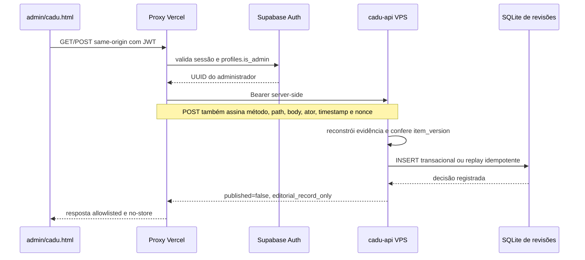

# Central de Revisões do Cadu

Data de consolidação: 2026-07-28.

## Objetivo

A aba **Revisões** de `admin/cadu.html` reúne decisões humanas associadas a
evidências da Pipeline, do Feed Coletado e do Mapa UFG. Ela não é uma segunda
fila de publicação e não concede autoridade nova ao navegador.

Princípios do contrato:

1. toda decisão aponta para uma evidência e uma versão exatas;
2. aprovação editorial não publica conteúdo;
3. uma decisão obsoleta ou conflitante falha fechada;
4. o histórico é consultável e exportável;
5. cada origem preserva seu contrato de escrita existente;
6. o provedor OpenClaw só receberá itens quando existir evidência estável,
   versionável e não sensível.

## Diagnóstico do run `27292866`

Identificador completo:
`27292866-7346-43a9-8bb1-b9c1dc37f184`.

O estado observado no VPS foi:

- estado persistido `finished`;
- exit code `0`;
- duração de 2.199,9 segundos;
- resultado agregado `partial`;
- nenhuma etapa obrigatória falhou.

Funil observado:

| Marco | Quantidade |
| --- | ---: |
| Fontes configuradas | 157 |
| Fontes tentadas | 142 |
| Itens coletados | 3.080 |
| Perfis Instagram concluídos | 75 de 76 |
| Candidatos do Curador | 30 |
| Novos/publicáveis | 29 |
| Formatados | 29 |
| Retidos pelo quality gate | 19 |
| Avaliados pelo publicador | 10 |
| Criados | 1 |
| Mesclados | 9 |

Portanto, `29 publicáveis` não significa `29 publicados` nem `29 itens
desaparecidos`: o conjunto foi particionado em `19 para revisão + 10 avaliados
pelo publicador`, e os 10 avaliados resultaram em `1 criado + 9 mesclados`.

O estado parcial veio exclusivamente de `enrich_items`, uma etapa opcional.
Duas fontes oficiais excederam duas tentativas de 15 segundos:

- `https://prpg.ufg.br/e/39230`;
- `https://propessoas.ufg.br/n/202964`.

Os posts já tinham três imagens e probes posteriores responderam HTTP 200 em
menos de um segundo. A causa é compatível com latência transitória do upstream.
O enriquecedor passou a repetir apenas timeout, erro de rede, corpo vazio e HTTP
transitório. Falhas permanentes `4xx` não são repetidas e uma terceira falha
continua deixando o run parcial, para não mascarar degradação.

## Deduplicação visual e textual

O modo real não estava quebrado. O preflight confirmou os nove estágios
executáveis e nenhum lock ativo. O bloqueio ocorre quando não existe uma
simulação recente e compatível com o estado atual.

Fluxo obrigatório:

1. clicar em **Simular**;
2. aguardar a conclusão;
3. o Admin atualiza o preflight;
4. **Executar real** fica disponível por até 30 minutos;
5. qualquer mudança no snapshot, pares, decisões ou plano exige nova simulação.

Uma simulação `f9740307…` e a execução real vinculada `462b79b9…` terminaram
com exit code zero e sem mutações. A ausência de mutação foi o resultado correto
do plano calculado, não uma falha.

O Admin agora:

- mantém **Simular** disponível quando o real está bloqueado;
- explica que a simulação recente é a condição para o modo real;
- reconsulta o preflight depois da simulação;
- não oferece atalho para ignorar snapshot, TTL ou plano.

## Provedores

### Pipeline

Projeta:

- itens retidos pelo quality gate;
- incidentes de runs parciais ou com falha.

Os artefatos de qualidade são imutáveis por run:

- `_formatted_<data>--<run-id>.json`;
- `_publish_skipped_quality_<data>--<run-id>.json`.

Os aliases diários continuam existindo para compatibilidade, mas não são usados
como identidade durável de uma decisão.

### Feed Coletado

Projeta somente itens que o Curador classificou explicitamente como
`revisão`/`review`, depois da validação estrutural e de URL HTTPS. O Feed
Coletado é memória operacional do Curador, não o feed público final.

### Mapa UFG

A fila `cadu_institutional_source_reviews` permanece no Supabase e conserva seu
contrato próprio:

- compare-and-swap por revisão da fonte;
- HMAC server-side;
- administrador derivado da sessão;
- resolução `approved`, `rejected` ou `superseded`;
- nenhuma resolução ativa fonte, Instagram, Pipeline ou publicação.

A aba central apenas move a visualização dessa fila para um lugar comum.

### OpenClaw

O cartão é intencionalmente reservado. Sessões, chats e logs não são tratados
como revisão porque não possuem, hoje, uma identidade editorial imutável
adequada. Criar itens artificiais a partir deles geraria decisões sem
proveniência confiável.

## Contrato de decisão central

O `cadu-api` expõe:

- `GET /api/reviews`;
- `GET /api/reviews/audit`;
- `POST /api/reviews/{review_id}/resolve`.

As decisões centrais são persistidas no volume do VPS em
`/data/cadu-review-center.db`, separado do banco da Pipeline. Cada registro
contém:

- `item_id`;
- `item_version`, SHA-256 da evidência editorial relevante;
- origem e tipo;
- decisão;
- nota;
- administrador;
- horário;
- snapshot do item decidido.

Decisões disponíveis:

- `approved`: aprovação editorial, sem publicar;
- `changes_requested`: exige nota;
- `rejected`: exige nota;
- `deferred`: adia a conclusão;
- `acknowledged`: reconhece um incidente operacional.

## Fluxo de segurança

Controles importantes:

- secrets não chegam ao navegador;
- métodos, filtros, estados, limites e URLs são allowlisted;
- respostas do upstream têm tamanho e schema validados;
- HMAC possui timestamp e nonce contra replay;
- a identidade do administrador não vem do corpo enviado pelo browser;
- decisão repetida igual é idempotente;
- decisão repetida diferente gera conflito;
- evidência alterada gera conflito de versão;
- respostas e páginas administrativas usam `private, no-store`.

## Interface

A aba oferece:

- cartões por origem com contadores;
- filtro de origem, estado e texto;
- paginação de 10, 25, 50 ou 100 itens;
- links HTTPS para fonte e ação;
- atalho para abrir o run da Pipeline;
- atalho para usar o contexto no chat do Cadu;
- formulário explícito de decisão;
- histórico recente;
- exportação JSON unificada da fila central e institucional.

No desktop e em viewport de 390 px não há overflow horizontal. O formulário
permanece dentro do cartão, as ações quebram em duas colunas no mobile e a
navegação inferior não cobre o conteúdo final.

## Limites deliberados

- Uma aprovação não reenvia o item ao publicador.
- A Central não altera post já publicado.
- A Central não executa deduplicação.
- A Central não ativa fonte do Mapa UFG.
- A Central não usa conversa do OpenClaw como evidência.
- A exportação é um relatório de auditoria, não um mecanismo de importação.

Qualquer efeito automático futuro deve ser outro comando, com novo preflight,
autorização explícita, idempotência e testes de regressão.

## Testes mínimos

- projeção de artefatos vinculados ao run;
- rejeição de artefato sobrescrito ou incompatível;
- filtros, paginação e busca;
- CAS por `item_version`;
- replay idempotente e conflito;
- nota obrigatória em rejeição e pedido de ajustes;
- autenticação admin e assinatura HMAC;
- confirmação `published: false`;
- validação estrita do proxy;
- troca entre histórico central e institucional;
- QA desktop/mobile sem overflow;
- health, readiness e preflight após deploy.

## Validação posterior: runs de 28/07

Os runs `bd38466f`, `29da18c0` e `6b0018ac` foram confrontados com logs,
artefatos e estado do Supabase.

- `bd38466f` terminou parcial apenas porque o site
  `artesdacenappg.iac.ufg.br` omite o intermediário correto da cadeia TLS. A
  Pipeline concluiu todas as etapas obrigatórias, produziu 26 itens novos,
  reteve 17 no quality gate e mesclou 9.
- `29da18c0` foi uma simulação válida de 136 posts, sem ocultações nem revisões
  planejadas.
- `6b0018ac` falhou corretamente antes de qualquer write: cinco posts foram
  encerrados e um foi editado entre a simulação e a execução real.

O bloqueio `dedup_preview_state_changed` continua obrigatório. Próximas
simulações passam a gerar um manifesto diagnóstico para identificar IDs
adicionados, removidos e alterados sem substituir o hash global de autorização.

A interface traduz esse motivo, realça o run aberto pela Central, confirma o
preenchimento do chat sem enviar mensagens e usa 10 itens como página inicial
em viewports de até 700 px. A faixa de subabas mantém a aba ativa visível e os
indicadores do OpenClaw usam uma grade responsiva.

Relatório operacional completo:
`openclaw-cadu/docs/incidents/2026-07-28-runs-bd38466f-29da18c0-6b0018ac.md`.
